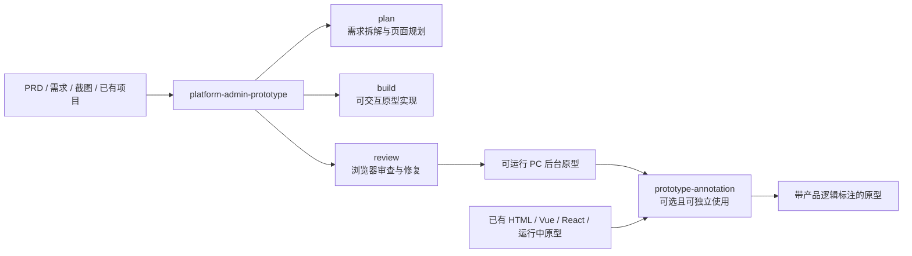
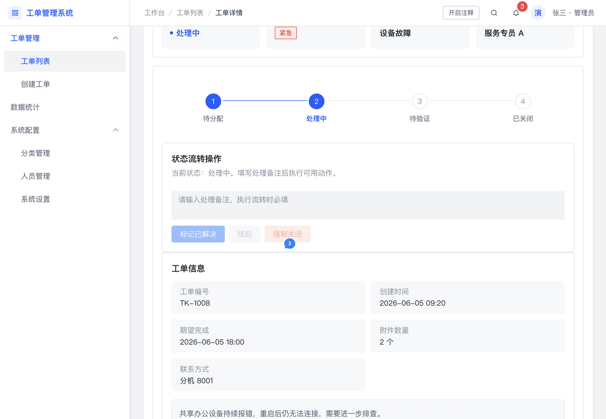
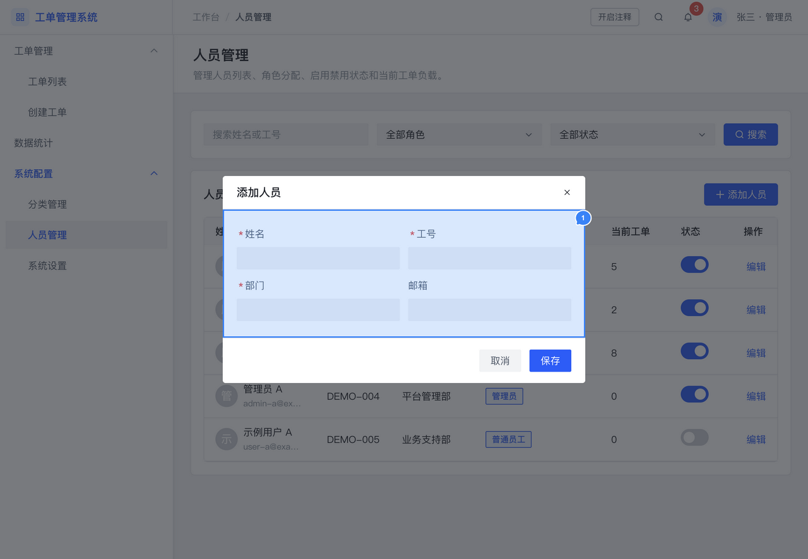
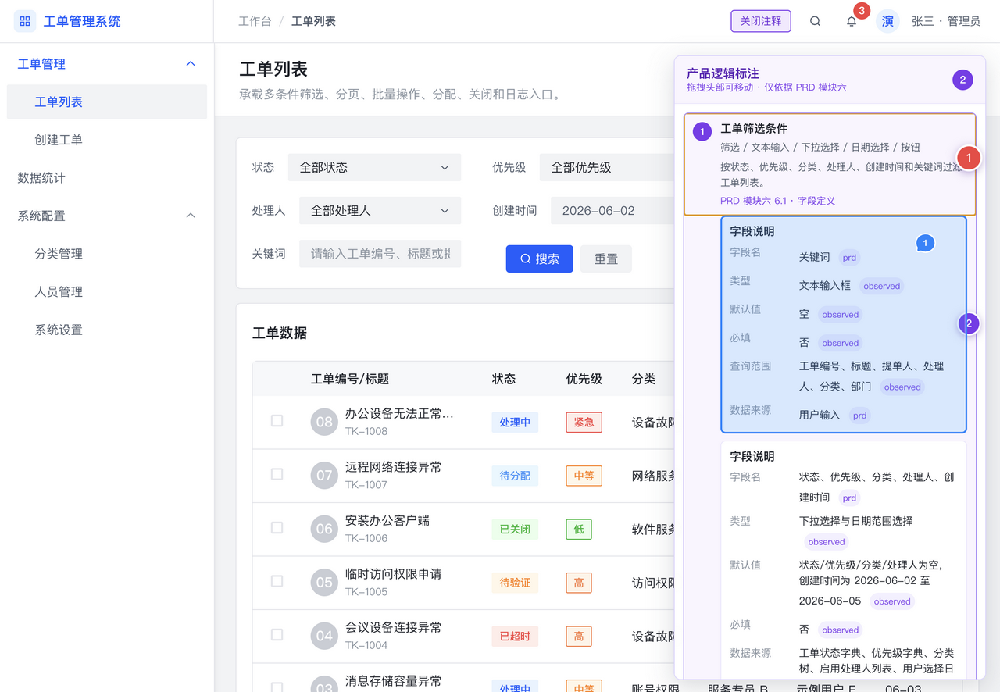
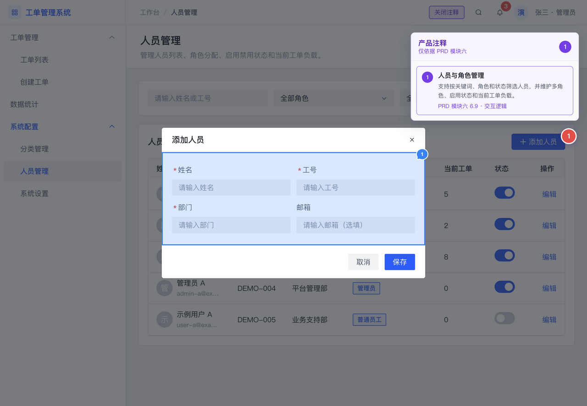
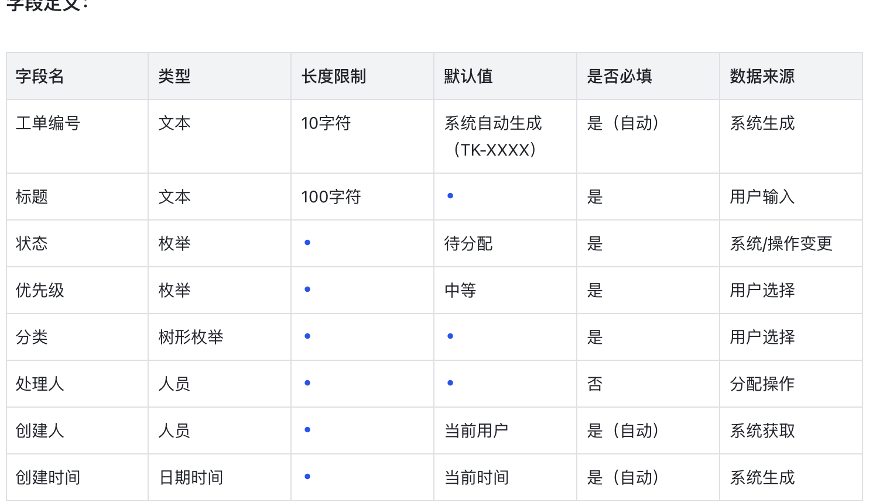

# Platform Admin Prototype

面向 PC 后台、B 端业务系统和 Admin 管理台的可交互原型 Skillset。

当前版本由两个可独立使用的 Codex Skills 组成：

- `platform-admin-prototype`：主控 Skill，负责规划、构建、审查和交付 PC 端可交互原型。
- `prototype-annotation`：独立注释 Skill，负责为已有原型、HTML 或前端项目生成结构化产品逻辑标注。

仓库同时提供 Vue 3 组件平台、规范文档、可运行示例和可直接安装的 `.skill` 包。

## Skillset 架构



| Skill | 定位 | 是否可独立使用 |
| --- | --- | --- |
| `platform-admin-prototype` | 生成、更新、审查和修复 PC 后台原型；完整任务按 `plan → build → review` 执行 | 是 |
| `prototype-annotation` | 为已有原型增加产品逻辑标注；支持计划、内容生成、集成和审查修复 | 是 |

## 当前版本重点

- 主控 Skill 拆分为 `plan`、`build`、`review` 三个可独立使用的工作流。
- 完整 PRD 原型任务必须先规划、再实现、最后审查并修复问题。
- 注释 Skill 不依赖主控 Skill、固定框架或固定组件库，可直接处理 HTML、Vue、React 或运行中的原型。
- 图表模块必须基于 [Apache ECharts 官方示例](https://echarts.apache.org/examples/zh/index.html) 选型，再适配产品配色与后台视觉规范。
- 所有填写组件必须显示真实默认值或明确 placeholder，两者使用不同语义和样式。
- 必填项必须显示红色星号，并在保存、提交或确认时执行真实校验；校验失败不得保存、关闭弹窗或显示成功结果。
- 交付可运行原型时，必须启动服务、验证访问地址，并提供完整可点击链接。

## PC 端原型主控 Skill

显式调用名称：

```text
$platform-admin-prototype
```

### 三个工作流

| 工作流 | 使用场景 | 主要输出 |
| --- | --- | --- |
| `plan` | 分析 PRD、设计页面结构、梳理字段和流程，不要求立即实现 | 页面地图、模块清单、交互与风险说明 |
| `build` | 从 PRD、需求或已有计划生成、更新可交互原型 | 可运行页面、真实交互、示例数据和访问链接 |
| `review` | 审查、验证、优化或修复已有 PC 后台原型 | 问题清单、修复结果和验证结果 |

完整任务默认执行：

```text
plan → build → review → 修复审查问题 → 交付访问链接
```

需要带注释的完整 PC 后台原型时：

```text
plan → build → review → prototype-annotation
```

### 已固化的实现规则

- 左侧导航只放一级业务页面；创建、编辑和详情等按钮触发页面属于二级页面。
- 二级页面保持父级导航选中，顶部使用精简面包屑。
- 筛选、表格、表单、详情、弹窗和抽屉必须实现真实业务交互，不生成静态展板。
- 下拉框保持正常控件高度，文本与箭头单行、垂直居中，禁止被全局 `span` 或 `svg` 样式破坏。
- 输入框、数字框和文本域使用“请输入…”；选择器、日期和树选择使用“请选择…”。
- 有明确默认值时显示真实默认值；没有默认值时显示 placeholder，禁止用 placeholder 冒充默认值。
- 必填字段失焦后校验当前字段，保存或提交时校验全部字段并阻止无效提交。
- 详情内容相邻模块保持统一间距，默认 `16px`。
- 图表不得使用手写 SVG、CSS 柱形、静态图片或伪图表替代真实 ECharts。

## 最新原型验收截图

以下截图来自本次新版 Skills 的实际原型验收过程。截图中的蓝色或红色编号属于浏览器验收评论标记，用于记录问题与规则，不属于产品 UI。

### 工作台与 ECharts 图表

识别“趋势、分布、占比、排行、统计看板”等图表意图，基于 ECharts 官方示例实现并适配平台配色。


### 表单默认值、placeholder 与必填规则

填写组件必须有初始展示；必填星号为红色，保存或提交必须执行真实校验。


### 详情页状态流转与模块间距

详情页支持状态流转、处理备注校验、业务操作和统一模块间距。



### 弹窗填写组件

弹窗、抽屉和页面表单遵守同一套默认值、placeholder、必填标识与保存校验规则。



## 独立注释 Skill

显式调用名称：

```text
$prototype-annotation
```

该 Skill 可以独立接收：

- 单个 HTML 文件或 HTML/CSS/JavaScript 项目
- Vue、React 或其他前端项目
- 本地运行中的可交互原型
- 原型加 PRD、需求、截图或产品笔记
- 没有 PRD 的原型，此时只使用可观察行为并明确标记推断

### 四种独立模式

| 模式 | 适用场景 | 是否修改代码 |
| --- | --- | --- |
| `plan-only` | 只分析标注目标、结构、证据和未决问题 | 否 |
| `annotate` | 为已有原型加入可工作的注释层 | 是 |
| `review-fix` | 审查并修复已有注释系统 | 视用户要求 |
| `content-only` | 只生成或修改注释文案与数据 | 否 |

### 注释内容只描述产品逻辑

注释不解释颜色、字号、阴影、间距等 UI 设计理由。它根据组件和字段类型，结构化说明：

- 字段名、字段类型和组件类型
- 默认值或空值规则
- 是否必填、长度、范围和格式限制
- 数据来源：用户输入、用户选择、系统生成、系统获取、操作变更或计算/统计
- 固定值字段适用时的 `取值定义`
- 按钮触发条件、点击结果、跳转目标、写入数据和阻断条件
- 存在真实业务规则时的状态流转规则

PRD 未定义的数据来源或取值定义先显示 `无`，不影响初版原型和注释生成；完成后统一向用户收集确认。PRD 与原型冲突、或 PRD 定义但原型未实现时，只暂停受影响的注释并询问用户，不静默做决定。

### 注释交互规则

- 注释层可开启、关闭或移除，不改变产品 UI 和业务状态。
- 标注面板可通过头部拖拽，并限制在浏览器可见区域内。
- 只有点击标注热点才打开说明，普通产品操作保持不变。
- 点击某条注释后，详细信息只在该条注释下方展开。
- 注释详情与序号圆点左边界对齐，不重复展示标题、组件类型和摘要。
- 注释证据保留 `prd`、`confirmed`、`observed`、`inferred` 标识。

## 注释 Skill 示例截图

### 页面内结构化产品逻辑标注

选中注释后，在对应条目下展开字段说明；内容聚焦字段、类型、默认值、必填、约束和数据来源。



### 弹窗与动态状态标注

注释可绑定弹窗、抽屉和其他动态状态；目标未出现时不展示对应热点。



### 字段定义与数据来源

注释中的数据来源描述业务值如何产生或获取，而不是 PRD 所在模块。固定值字段还会按 PRD 定义补充取值定义。



## 使用示例

### 从 PRD 生成完整 PC 后台原型

```text
使用 $platform-admin-prototype，根据这份 PRD 生成可交互的 PC 后台原型。
先规划页面结构，再实现并审查；完成后启动项目并提供访问链接。
```

### 只规划，不实现

```text
使用 $platform-admin-prototype，只分析这份 PRD 并输出 PC 后台原型方案，
不要修改代码。
```

### 审查并修复已有原型

```text
使用 $platform-admin-prototype，审查这个已有 PC 后台项目，
修复组件、交互、校验、图表和布局问题。
```

### 为已有原型加入注释

```text
使用 $prototype-annotation，根据这个 HTML 文件和 PRD 生成产品逻辑标注。
未知的数据来源和取值定义先显示无，完成初版后统一向我确认。
```

### 只生成注释内容

```text
使用 $prototype-annotation 的 content-only 模式，
根据现有原型生成结构化注释数据，不修改项目代码。
```

## 安装 Skills

### 下载安装包

- [下载 platform-admin-prototype.skill](https://github.com/cdy1315732/platform-admin-prototype/raw/refs/heads/main/dist/skills/platform-admin-prototype.skill)
- [下载 prototype-annotation.skill](https://github.com/cdy1315732/platform-admin-prototype/raw/refs/heads/main/dist/skills/prototype-annotation.skill)

`.skill` 文件本质上是包含 Skill 目录的压缩包，可以通过支持 Skill 导入的客户端安装，也可以解压到 Codex Skills 目录：

```bash
unzip platform-admin-prototype.skill -d ~/.codex/skills
unzip prototype-annotation.skill -d ~/.codex/skills
```

### 从源码安装

```bash
git clone https://github.com/cdy1315732/platform-admin-prototype.git
cp -R platform-admin-prototype/skills/platform-admin-prototype ~/.codex/skills/
cp -R platform-admin-prototype/skills/prototype-annotation ~/.codex/skills/
```

## 本地运行

环境要求：

- Node.js
- pnpm

安装依赖并启动演示原型：

```bash
pnpm install
pnpm dev:playground
```

macOS 也可以双击：

- `start.command`：启动原型并自动打开 `http://localhost:5173/`
- `stop.command`：只关闭本项目启动的原型服务

运行日志与 PID 存放在 `.runtime/`。

## 仓库结构

```text
platform-admin-prototype/
├── apps/
│   ├── docs/                         # 组件文档站
│   └── playground/                   # 可交互后台原型
├── packages/
│   ├── components/                   # 组件源码
│   ├── tokens/                       # 设计变量
│   ├── registry/                     # 组件注册表
│   ├── patterns/                     # 组合模式
│   ├── templates/                    # 页面模板
│   └── prd-composer/                 # PRD 到组件映射
├── docs/
│   ├── platform-admin-spec/          # PC 后台规范
│   └── screenshots/                  # 最新验收与注释示例截图
├── skills/
│   ├── platform-admin-prototype/
│   │   ├── SKILL.md
│   │   ├── workflows/
│   │   │   ├── plan.md
│   │   │   ├── build.md
│   │   │   └── review.md
│   │   ├── references/
│   │   └── assets/component-source/
│   └── prototype-annotation/
│       ├── SKILL.md
│       └── references/
└── dist/skills/
    ├── platform-admin-prototype.skill
    └── prototype-annotation.skill
```

## 规范文档

| 文档 | 内容 |
| --- | --- |
| [组件目录](docs/platform-admin-spec/component-catalog.md) | 基础组件、组合组件和页面模板 |
| [PRD 到原型工作流](docs/platform-admin-spec/prd-to-prototype-workflow.md) | 需求识别、页面拆分、实现与验证 |
| [页面模式](docs/platform-admin-spec/page-patterns.md) | 工作台、列表、表单、详情和设置页 |
| [组合模式](docs/platform-admin-spec/composition-patterns.md) | 筛选、表格、表单、详情与反馈 |
| [交互状态](docs/platform-admin-spec/interaction-states.md) | 输入、筛选、排序、弹窗、抽屉与上传 |
| [视觉规则](docs/platform-admin-spec/visual-rules.md) | 间距、对齐、导航、状态和表单规则 |
| [图表规则](docs/platform-admin-spec/chart-rules.md) | ECharts 选型、配色适配和验证规则 |

## 验证

```bash
pnpm test
pnpm typecheck
pnpm build
```

验证 Skills：

```bash
python3 /path/to/skill-creator/scripts/quick_validate.py skills/platform-admin-prototype
python3 /path/to/skill-creator/scripts/quick_validate.py skills/prototype-annotation
```

## 技术栈

- Vue 3
- TypeScript
- Vite
- Arco Design Vue
- Apache ECharts
- Vitest
- VitePress

## License

[MIT](LICENSE)
