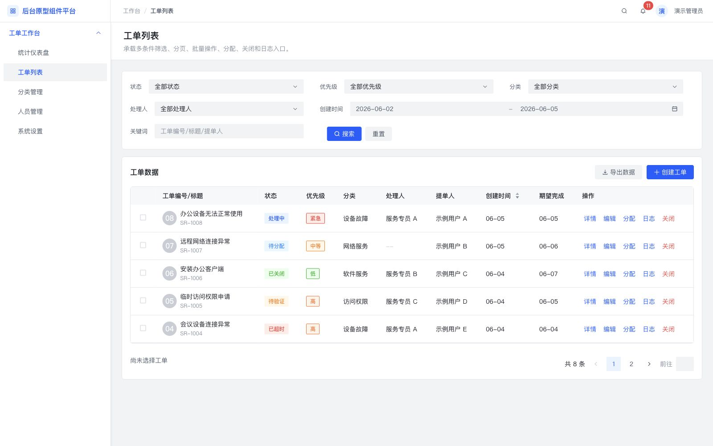
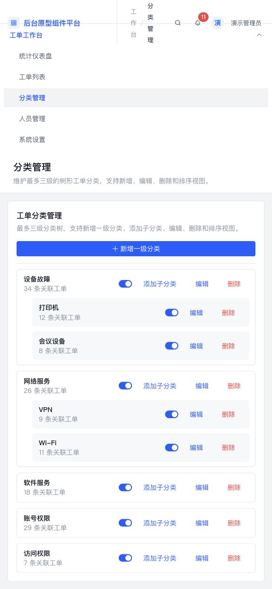

# Platform Admin Prototype

一套面向 PC 端后台、B 端系统和管理台的 Vue 3 组件平台与 Codex Skill。

项目将经过实际页面验收的组件样式、页面结构、交互规则和原型生成流程固化到本地代码与 Skill 中。用户提供 PRD、需求描述、页面清单或截图后，Skill 可以按照这些规范生成可点击、可输入、可切换状态的后台原型，而不是每次临时重新设计组件。

## 项目目标

- 把后台常用组件沉淀为可直接复用的前端代码。
- 把筛选、表格、表单、详情、弹窗、抽屉等模块封装为组合组件。
- 把列表页、详情页、创建页、设置页等页面结构沉淀为页面模板。
- 把已确认的视觉与交互偏好写入 Skill，减少重复沟通。
- 让 PRD 到可交互原型的生成过程稳定、可复现、可扩展。
- 同时提供组件源码、规范文档、运行示例和可安装 Skill 包。

## 核心能力

| 能力 | 说明 |
| --- | --- |
| PRD 信息提取 | 从 PRD、需求描述、截图或产品笔记中提取页面、字段、筛选项、表格列、按钮、状态、权限和业务流程。 |
| 页面架构规划 | 区分一级导航页面、二级页面、弹窗和抽屉，避免把所有内容堆在一个页面。 |
| 本地组件匹配 | 根据需求优先匹配 `@platform/components` 中的基础组件、组合组件和页面模板。 |
| 可交互原型生成 | 实现导航、输入回显、筛选、重置、勾选、批量操作、排序、分页、弹窗、抽屉、上传和状态切换。 |
| 视觉规范约束 | 使用本仓库已经确认的间距、卡片、状态、顶部导航、表格、弹窗、上传和开关规范。 |
| 图表条件选型 | 只有 PRD 明确出现趋势、分布、排行或统计可视化时，才进入 ECharts 图表选型流程。 |
| 浏览器验证 | 默认检查页面可打开、交互有效，并排查溢出、错位、重叠和不可读问题。 |
| Skill 离线使用 | Skill 包内包含组件源码快照和规范文档，没有完整仓库时也可作为实现参考。 |

## 详细功能说明

### 工作台与统计页

- 使用指标卡片展示总量、待处理、已完成、超时等核心数据。
- 支持重点事项、快捷入口、分布数据、最近操作等常见后台模块。
- 图表不是默认必选项。只有需求中明确出现趋势、占比、分布、排行、漏斗或其他数据可视化时，才使用 ECharts。
- 图表选型参考 ECharts 官方示例，但图表容器、标题、颜色、间距和页面布局仍遵守本仓库规范。

### 筛选与查询

- 支持输入框、下拉选择、级联选择、树选择、日期和时间区间等筛选条件。
- 下拉筛选默认提供“全部状态”“全部角色”等明确初始值。
- 日期区间具有稳定最小宽度，不会被挤压到无法识别。
- 搜索与重置按钮靠近筛选字段、左对齐并保持同一基线。
- 重置操作恢复默认筛选值、关键词、日期和分页状态。

### 数据列表与表格

- 支持主副文本、头像、状态、优先级、分类、时间、开关和行操作等单元格。
- 支持表格勾选、全选、分页、排序、空状态和加载状态。
- 批量操作仅在存在勾选项时出现，并与已选择数量处于同一操作区域。
- 创建时间等排序列默认不选中，点击后在升序和降序之间切换。
- 创建、导出、添加等表格级操作位于表格标题右侧。
- 行级操作支持详情、编辑、分配、日志、关闭和删除等业务命令。

### 创建与编辑表单

- 支持文本、数字、密码、选择器、日期、时间、复选框、单选框、开关、标签输入和文本域。
- 输入内容必须实时回显，并支持默认值、禁用、校验、错误提示和字数限制。
- 文件上传默认没有文件，使用灰色上传按钮，并区分可点击、上传中、成功、失败、删除和禁用状态。
- 页面表单的取消和提交按钮位于表单底部；轻量新增和编辑使用表单弹窗。
- 创建和编辑页面通常由按钮触发，属于二级页面，不进入左侧一级导航。

### 详情与流程

- 支持页面标题、辅助信息、操作按钮、状态摘要、基础字段、流程步骤和操作时间线。
- 状态使用颜色圆点加文案，优先级使用紧凑边框标签。
- 审批、生命周期和处理进度使用步骤节点，不使用普通标签拼接代替。
- 操作按钮与标题同一行时不额外增加间距；换行时保持 `12px` 垂直间距。
- 详情可以作为独立二级页面，也可以根据业务复杂度使用右侧抽屉。

### 弹窗、抽屉与反馈

- 弹窗保持视口居中，标题左对齐，左右内边距固定为 `20px`。
- 抽屉用于辅助详情、较长编辑表单和不应打断主任务的操作。
- 保存、提交和删除等轻量反馈优先使用全局消息。
- 明确的成功、失败或异常结论可以使用结果组件；不随意创建独立的大型结果页。
- 危险操作需要确认步骤，取消按钮使用灰色次级样式。

### 配置、分类与人员管理

- 支持分类树、组织树、角色、人员、启用禁用和层级操作。
- 分类节点可承载添加子节点、编辑、删除和开关状态。
- 人员列表支持角色和状态筛选、启用禁用、编辑和批量处理。
- 设置页通过页内菜单或标签页组织基础设置、通知设置和业务规则。
- 开关使用本地修正后的样式，小号圆点始终保持上下居中。

## 适用场景

适用于：

- PC 后台管理系统
- B 端业务系统
- Admin 管理台
- 数据工作台和统计仪表盘
- 列表、筛选、表格和分页页面
- 新增、编辑和配置表单
- 详情页、详情抽屉和操作日志
- 分类树、组织树、角色和人员管理
- 审批流程、生命周期和状态流转
- 弹窗、抽屉、结果反馈和全局提示

不适用于：

- 移动端和小程序前台
- 官网、营销页和活动页
- C 端消费产品
- 暗黑模式
- 只需要静态说明文档、不需要原型或前端实现的任务

## 页面成果

### 统计工作台

包含指标卡片、重点事项、快捷入口、分布数据和最近操作。页面模块使用一致间距，并保持宽屏后台信息密度。


### 列表页

包含多条件筛选、日期范围、关键词、搜索与重置、表格、时间排序、批量操作、分页、导出和新增入口。



### 创建表单

包含文本输入、下拉选择、日期选择、标签、文本域、文件上传、取消和提交状态。创建页属于按钮触发的二级页面，不进入侧边导航。


### 详情页

包含详情头部操作、状态摘要、流程步骤、基础信息、时间线和相关操作。状态使用颜色圆点加文案，优先级使用紧凑标签。


### 分类管理

包含层级分类、启用禁用、添加子分类、编辑和删除操作，适合分类树、组织树和权限树场景。



## 组件体系

### 基础组件

- 按钮、链接、徽标、标签
- 输入框、数字输入框、密码输入框
- 下拉选择、级联选择、树选择
- 日期、日期区间、时间选择
- 复选框、单选框、开关
- 文本域、标签输入、文件上传

### 表格单元格组件

- 头像与主副文本
- 状态圆点与文案
- 优先级和枚举标签
- 勾选、展开、开关
- 可排序表头
- 行操作链接组

### 组合组件

- `PlatformFilterPanel`: 多条件筛选模块
- `PlatformTableCard`: 表格标题、操作、批量操作和分页容器
- `PlatformFormCard`: 创建与编辑表单容器
- `PlatformDetailSummary`: 详情摘要字段
- `PlatformDataTable`: 后台数据表格
- `PlatformModal`: 居中弹窗
- `PlatformDrawer`: 右侧抽屉
- `PlatformResult`: 操作结果反馈
- `PlatformSteps`: 流程和生命周期
- `PlatformTimeline`: 日志和状态变化

### 页面模板

- `PlatformListPageTemplate`
- `PlatformDetailPageTemplate`
- `PlatformFormModalTemplate`
- `PlatformDetailDrawerTemplate`
- `PlatformResultPageTemplate`

完整组件用途和规则见 [组件目录](docs/platform-admin-spec/component-catalog.md)。

## 已固化的交互偏好

- 生成真实后台工作流，而不是单页组件展板。
- 左侧导航只放一级业务页面。
- 创建、编辑和详情等按钮触发页面作为二级页面。
- 二级页面保持父级导航选中状态。
- 顶部使用精简面包屑，避免重复显示系统名称。
- 卡片间距默认保持一致，通常为 `16px`。
- 不使用卡片套卡片，不制造无意义的大面积留白。
- 筛选项左对齐，搜索与重置紧邻筛选字段并保持同一基线。
- 筛选下拉默认提供“全部状态”“全部角色”等明确默认值。
- 表格级新增、导出等操作放在表格标题右侧。
- 批量操作只在用户勾选数据后显示。
- 时间排序默认不选中，点击后切换升序和降序。
- 头像必须保持正圆，不允许被表格宽度压扁。
- 详情状态使用颜色圆点加文案，优先级使用紧凑边框标签。
- 流程状态使用步骤节点，不使用普通标签条代替。
- 弹窗居中，标题左对齐，左右内边距为 `20px`。
- 上传默认无文件，使用灰色按钮，并提供可点击和禁用状态。
- 小号开关圆点必须上下居中。

更多规则见：

- [页面模式](docs/platform-admin-spec/page-patterns.md)
- [组合模式](docs/platform-admin-spec/composition-patterns.md)
- [交互状态](docs/platform-admin-spec/interaction-states.md)
- [视觉规则](docs/platform-admin-spec/visual-rules.md)
- [图表规则](docs/platform-admin-spec/chart-rules.md)

## 文档导航

| 文档 | 内容 |
| --- | --- |
| [Skill 使用指南](docs/SKILL_GUIDE.md) | Skill 的触发条件、输入、执行流程、输出、功能行为和使用示例。 |
| [组件目录](docs/platform-admin-spec/component-catalog.md) | 基础组件、表格单元格、组合组件和页面模板的用途与规则。 |
| [PRD 到原型工作流](docs/platform-admin-spec/prd-to-prototype-workflow.md) | 从需求识别、页面拆分、组件匹配到实现与验证的完整流程。 |
| [页面模式](docs/platform-admin-spec/page-patterns.md) | 工作台、列表页、表单页、详情页、设置页等页面结构。 |
| [组合模式](docs/platform-admin-spec/composition-patterns.md) | 筛选、表格、表单、详情和反馈模块的组合方法。 |
| [交互状态](docs/platform-admin-spec/interaction-states.md) | 输入、筛选、排序、批量操作、弹窗、抽屉、上传和开关状态。 |
| [视觉规则](docs/platform-admin-spec/visual-rules.md) | 间距、对齐、卡片、导航、状态、弹窗和响应式约束。 |
| [图表规则](docs/platform-admin-spec/chart-rules.md) | 何时使用图表、如何选择 ECharts 示例以及图表页面约束。 |
| [代码示例](docs/platform-admin-spec/usage-examples.md) | 本地组件和页面模板的调用示例。 |

## Skill 如何工作

Skill 的默认执行流程：

1. 判断需求是否属于 PC 后台或 B 端系统。
2. 从输入中提取页面、字段、表格、筛选、按钮、状态和流程。
3. 区分一级导航、二级页面、弹窗和抽屉。
4. 根据组件目录选择本地组件和页面模板。
5. 替换业务文案、字段、表格列、状态和示例数据。
6. 实现完整交互，不只生成静态页面。
7. 在浏览器中验证页面和交互。
8. 输出代码、运行地址、验证结果和必要假设。

详细说明见 [Skill 使用指南](docs/SKILL_GUIDE.md)。

## 安装 Skill

### 下载打包文件

[下载 platform-admin-prototype.skill](https://github.com/cdy1315732/platform-admin-prototype/raw/refs/heads/main/dist/skills/platform-admin-prototype.skill)

`.skill` 文件本质上是包含 Skill 目录的压缩包。可以通过支持 Skill 导入的客户端安装，也可以解压到 Codex Skills 目录：

```bash
unzip platform-admin-prototype.skill -d ~/.codex/skills
```

### 从源码安装

```bash
git clone https://github.com/cdy1315732/platform-admin-prototype.git
cp -R platform-admin-prototype/skills/platform-admin-prototype ~/.codex/skills/
```

安装后可以显式调用：

```text
使用 $platform-admin-prototype，根据这份 PRD 生成一个可交互的 PC 后台原型。
```

Skill 也允许在明确的 PC 后台原型需求中被自动触发。

## 输入与输出

### 支持的输入

- PRD 文档内容
- 功能需求描述
- 页面清单和字段清单
- 业务流程或状态流转说明
- 页面截图或参考图
- 表格列、筛选项、权限和操作规则

### 默认输出

- 可运行的 Vue 3 页面
- 真实的后台导航结构
- 可交互的筛选、表格、表单、弹窗和抽屉
- 模拟业务数据和状态
- 浏览器验证结果
- 需求歧义下采用的实现假设

## 示例提示词

```text
使用 $platform-admin-prototype，根据这份 PRD 生成一个客户管理后台。
需要客户列表、客户详情、创建客户、跟进记录抽屉和批量分配功能。
```

```text
这是一个权限管理需求。请生成 PC 管理台原型，
包含人员列表、角色筛选、启用禁用、角色配置弹窗和操作日志。
```

```text
根据以下需求生成运营工作台。
需要指标卡片、趋势图、渠道分布、异常列表和详情抽屉。
```

## 本地运行

环境要求：

- Node.js
- pnpm

安装依赖并启动原型：

```bash
pnpm install
pnpm dev:playground
```

启动组件文档：

```bash
pnpm dev:docs
```

## 项目结构

```text
platform-admin-prototype/
├── apps/
│   ├── docs/                     # 组件文档站
│   └── playground/               # 可交互后台原型
├── packages/
│   ├── components/               # 组件源码
│   ├── tokens/                   # 设计变量
│   ├── registry/                 # 组件注册表
│   ├── patterns/                 # 组合模式
│   ├── templates/                # 页面模板
│   └── prd-composer/              # PRD 到组件的映射能力
├── docs/
│   ├── platform-admin-spec/       # 规范文档
│   ├── screenshots/               # PC 宽屏成果图
│   └── SKILL_GUIDE.md             # Skill 详细说明
├── skills/platform-admin-prototype/
│   ├── SKILL.md
│   ├── references/
│   └── assets/component-source/
└── dist/skills/
    └── platform-admin-prototype.skill
```

## 验证

```bash
pnpm test
pnpm typecheck
pnpm build
```

验证 Skill 目录：

```bash
python3 /path/to/skill-creator/scripts/quick_validate.py \
  skills/platform-admin-prototype
```

## 技术栈

- Vue 3
- TypeScript
- Vite
- Arco Design Vue
- Vitest
- VitePress
- ECharts，按图表需求条件使用

## License

[MIT](LICENSE)
